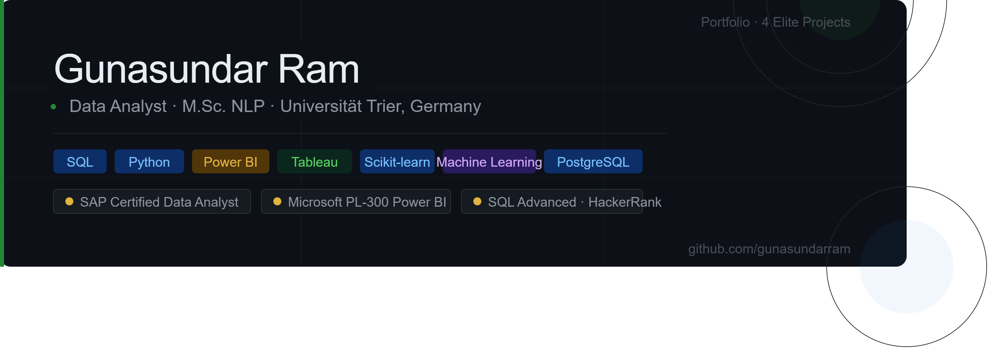

# Hey, I'm Ram👋

**Data Analyst | M.Sc. NLP · Universität Trier, Germany**

---

## 🧰 Tech Stack

**Data & Analytics**
`SQL` `Python` `Power BI` `Excel` `Tableau` `SAP Analytics Cloud`

**Python Libraries**
`Pandas` `NumPy` `Scikit-learn` `Matplotlib` `Seaborn` `HuggingFace Transformers`

**Tools & Workflow**
`Git` `VS Code` `Jupyter` `PostgreSQL` `Azure` `AWS` `Jira`

---

## 📂 Featured Projects

> 🚧 Projects 3 & 4 are currently in development — check back soon.

| 01 | [NHS Weekend Admissions — Readmission Risk Analysis](https://github.com/gunasundarram/01-nhs-weekend-admissions) | SQL · Excel · Tableau | Healthcare |

| 02 | [Olist Marketplace — Seller Survival Analysis](https://github.com/gunasundarram/02-olist-seller-survival) | Python · SQL · Power BI | E-Commerce |

| 03 | [HR Attrition Blindspot — High Performer Flight Risk](https://github.com/gunasundarram/03-hr-attrition-blindspot) | Python · Power BI | HR Analytics |

| 04 | [Diabetes Risk Predictor — Clinically Responsible ML](https://github.com/gunasundarram/04-diabetes-ml-predictor) | Python · Scikit-learn · Streamlit | Healthcare · ML |

---

## 📜 Certifications & Recognition

- 🏅 Data Analyst in SAP Analytics Cloud  -  SAP Certified (2026)
- 🏅 SQL Advanced Certification  -  HackerRank (2026)
- 🏅 Microsoft Power BI Data Analyst PL 300  -  Microsoft (2024)
- 🏆 Highako Intern of the Year 2022-23 Excellence Award  -  HighRadius (2023)

---

## 📬 Connect with Me

